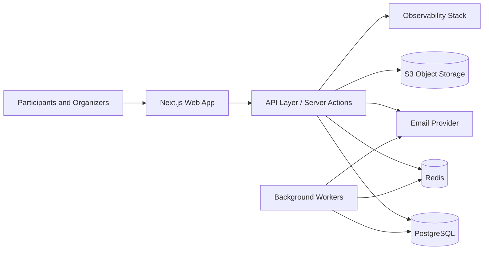

# Hackathon Portal Architecture

## 1) System Overview

The portal is designed as a modular web application with a Backend-for-Frontend pattern using Next.js Route Handlers and Server Actions.

Core runtime components:
- Web app and API edge: Next.js 16 App Router
- Primary database: PostgreSQL 16
- Cache and queue broker: Redis 7
- Object storage: S3-compatible bucket (AWS S3 or Cloudflare R2)
- Transactional email: Resend (or SMTP fallback)
- Observability: Sentry + structured logs

## 2) High-Level Component Diagram

## 3) Bounded Modules

1. Identity and Access
- Sign up, login, reset password, session handling
- Role and permission enforcement
- Admin account lifecycle and audit logging

2. Registration and Profiles
- Participant details and consent capture
- Registration state transitions (draft, submitted, approved, waitlisted)
- Eligibility and validation rules

3. Teams
- Team creation and captain ownership
- Member invite and acceptance flows
- Team lock behavior after cutoff

4. Tracks
- Track definitions, capacities, and status
- Team-to-track assignment rules
- Waitlist behavior and reassignment logic

5. Submissions and Judging
- Team project submission and deadline enforcement
- Judge assignments and rubric scoring
- Finalist ranking export

6. Event Check-In
- QR scan validation
- Manual badge lookup fallback
- Duplicate detection, override policy, and event audit records

7. Notifications
- Email templates and trigger orchestration
- Reminders for incomplete registration/team/submission tasks

8. Reporting and Operations
- Admin analytics dashboard
- CSV exports for roster/check-in/judging
- Immutable operational audit logs

## 4) API and Execution Pattern

- UI-first routes under src/app for participant and organizer screens.
- Server Actions for form-heavy mutations where CSRF protection and direct action mapping are useful.
- Route Handlers under src/app/api for scanner/mobile integrations and external service callbacks.
- Zod schemas at module boundaries for request and response validation.

## 5) Data Architecture

Primary persistence is relational with Prisma ORM.

Key entities:
- User, ParticipantProfile
- Team, TeamMember, TeamInvite
- Track
- Submission
- CheckIn
- AuditLog

Data integrity rules:
- Unique email and unique team names.
- Single active membership per user per team.
- Team-level track assignment.
- Check-in and admin actions always produce audit events.

## 6) Security Architecture

- Role-based authorization for every write endpoint.
- Row-level constraints in service layer for support and judge roles.
- Rate limiting on auth and registration endpoints.
- Bot protection on public registration.
- Password hashing with Argon2.
- PII minimization, encryption at rest in managed services, and explicit data retention windows.

## 7) Event-Day Check-In Architecture

- Fast path: QR payload with participant ID + signed token.
- Fallback path: manual lookup by name/email/badge ID.
- Device workflow: scanner UI with optimistic response + server confirmation.
- Operational safeguards: duplicate handling, override reasons, and actor attribution.

## 8) Deployment Topology

Environments:
- Local: Docker services + Next.js dev server
- Staging: single region, production-like config, seeded test data
- Production: managed PostgreSQL, managed Redis, object storage, CDN

Deployment model:
- Continuous delivery from main branch.
- Prisma migrations executed in CI/CD deploy step before app rollout.
- Blue/green or rolling deployment strategy for zero-downtime updates.

## 9) Reliability and Performance Targets

- P95 page render: < 500ms for dashboard and roster pages
- Check-in API latency: < 250ms at P95
- Support 1,000+ concurrent users during peak registration windows
- Event-day check-in throughput target: >= 30 scans/minute per operator

## 10) Implementation Folder Blueprint

Suggested internal organization as features grow:
- src/app: pages, layouts, and route handlers
- src/server/modules: domain services per module
- src/server/repos: Prisma access wrappers
- src/server/policies: RBAC and authorization policies
- src/server/queues: async jobs and worker handlers
- src/server/validation: Zod schemas
- src/server/events: audit and notification events

## 11) Non-Goals for V1

- Native mobile app
- Offline sync scanner protocol
- Multi-tenant event hosting in one deployment
